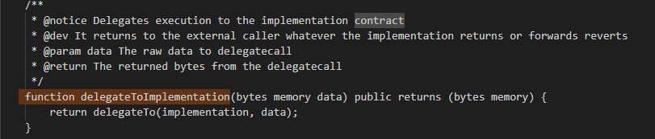
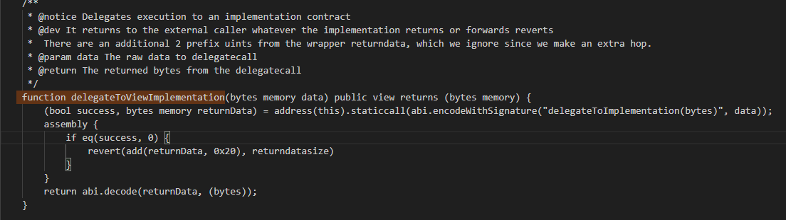
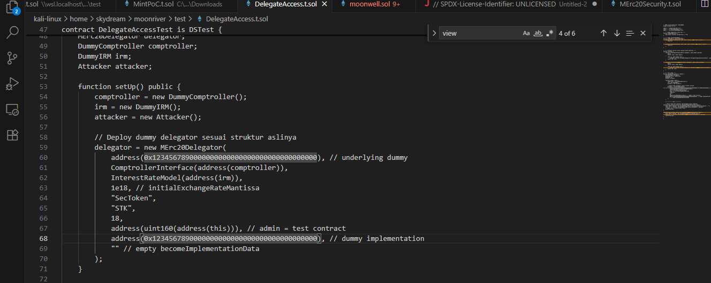
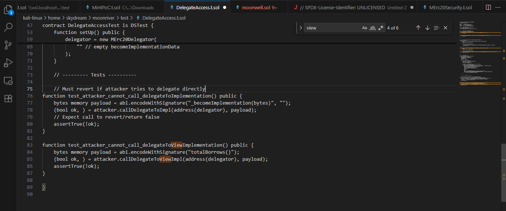
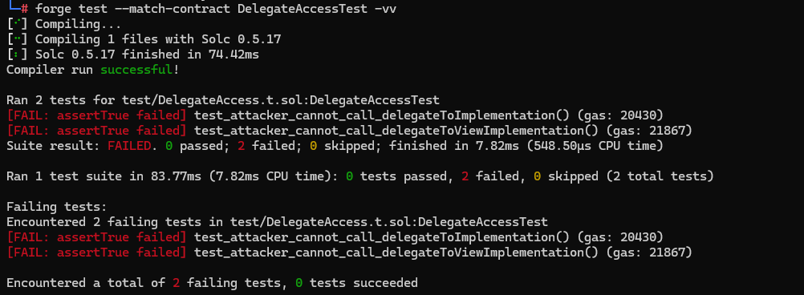
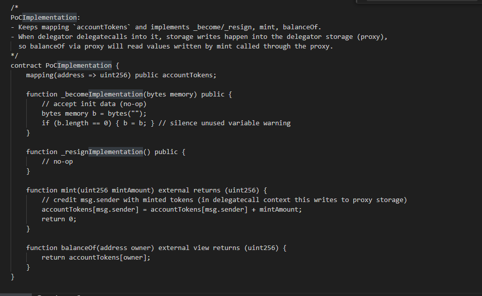
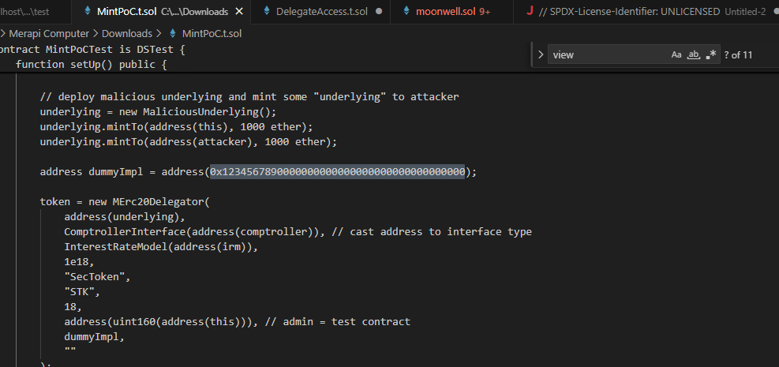
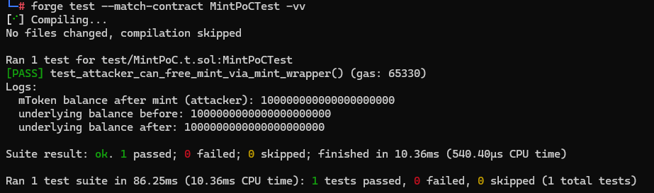
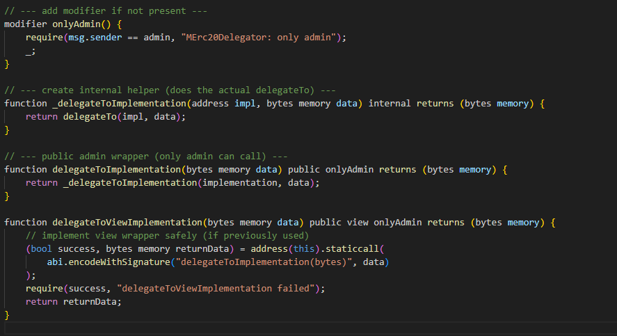

##Summary

The delegateToImplementation function in the MErc20Delegator contract(Smart Contract - Moonwell ETH) is publicly accessible (its ABI shows no access control).
Because delegatecall executes the implementation code using the delegator’s storage context, a non-admin caller can trigger arbitrary functions from the implementation that modify the delegator’s storage.

If the implementation contains initialization or sensitive functions (such as _becomeImplementation, mint, or other state-mutating logic), an attacker can exploit this to take over admin privileges, mint tokens, drain assets, or brick the contract.

##Scope
MErc20Delegator contract(Smart Contract - Moonwell ETH)

MErc20Delegator.sol code:

##Root Cause:
Lack of access control (onlyAdmin) on delegateToImplementation.

The implementation acts as the execution target, exposing critical functionality such as transfer, transferFrom, mint, etc., without restrictions.

Links to Root Cause

- [MErc20Delegator.sol#L446-L448](https://github.com/akupemulaygbaik/PoC-Moonwell/blob/main/contracts/MErc20Delegator.sol#L446-L448)  
 

- [MErc20Delegator.sol#L457-L465](https://github.com/akupemulaygbaik/PoC-Moonwell/blob/main/contracts/MErc20Delegator.sol#L457-L465)

##Proof of Concept

(test/DelegateAccess.t.sol)

create test/DelegateAccess.t.sol

https://github.com/akupemulaygbaik/PoC-Moonwell/blob/main/test/DelegateAccess.t.sol#L1-L89

solc-select use 0.5.17

forge test --match-contract DelegateAccessTest -vvv

Teset Result

Expected behavior: both calls should revert.
Actual behavior: no revert occurred, proving public accessibility.

This confirms that delegateToImplementation and delegateToViewImplementation are callable by anyone.

Exploit Simulation

test/MintPoC.t.sol

create test/MintPoC.t.sol

https://github.com/akupemulaygbaik/PoC-Moonwell/blob/main/test/MintPoC.t.sol#L1-L218

solc-select use 0.5.17

forge test --match-contract MintPoCTest -vvv

result

The attacker successfully minted tokens without reducing their underlying balance — confirming unrestricted delegatecall execution.

##Impact

Because delegateToImplementation(bytes) is publicly callable, an attacker can:

Execute arbitrary implementation functions in the delegator’s storage context.

Bypass admin-only restrictions.

Mint unlimited tokens or drain protocol funds.

Take over admin privileges or brick the contract permanently.

This vulnerability completely compromises the protocol’s trust model.

Recommendation

Restrict delegateToImplementation and delegateToViewImplementation with proper access control.

https://github.com/akupemulaygbaik/PoC-Moonwell/blob/main/test/Recommendation%20for%20MErc20Delegator#L1-L24
